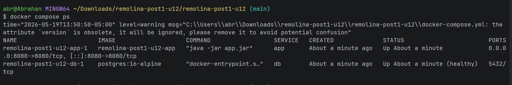
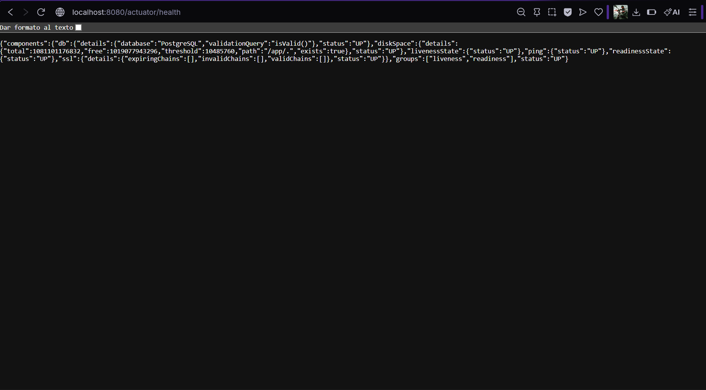
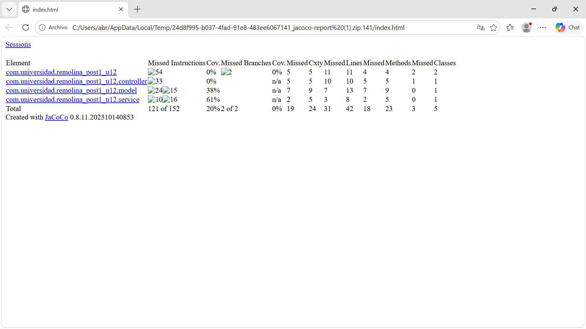
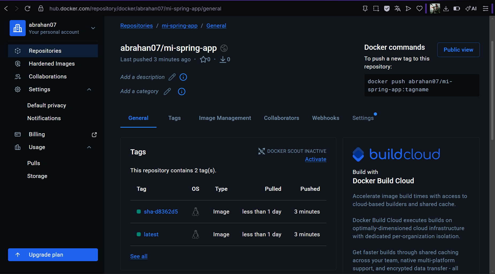
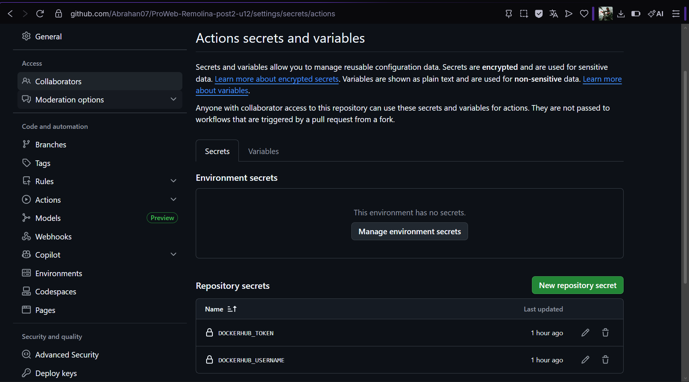

# Laboratorio Post-Contenido 2 — Unidad 12: Despliegue y CI/CD


API REST de productos construida con Spring Boot, contenedorizada con Docker y desplegada con un pipeline CI/CD automatizado usando GitHub Actions y Docker Hub.

---

## Pipeline CI/CD

El pipeline se activa automáticamente en cada `push` a la rama `main` y realiza los siguientes pasos:

### Job 1 — `build-and-test`
- Configura JDK 21 con caché de dependencias Maven
- Compila el proyecto con `mvn clean verify`
- Ejecuta las pruebas unitarias (Mockito)
- Genera el reporte de cobertura con JaCoCo
- Publica el reporte JaCoCo como artefacto descargable (retención: 7 días)

### Job 2 — `docker-publish`
- Se ejecuta solo en `push` a `main` (no en pull requests)
- Depende de que `build-and-test` termine exitosamente (`needs: build-and-test`)
- Se autentica en Docker Hub usando GitHub Secrets
- Construye la imagen Docker con multi-stage build
- Publica la imagen con dos tags: `latest` y `sha-<commit>`

### Evidencia del pipeline

**Historial de ejecuciones en GitHub Actions (ejecuciones exitosas):**



**Detalle del workflow con ambos jobs en verde:**



**Artefacto JaCoCo disponible para descarga:**



**Imagen publicada en Docker Hub con tags `latest` y `sha-<commit>`:**



**GitHub Secrets configurados en el repositorio:**



---

## GitHub Secrets requeridos

Para que el pipeline funcione correctamente deben estar configurados los siguientes secrets en **Settings → Secrets and variables → Actions**:

| Secret | Descripción |
|---|---|
| `DOCKERHUB_USERNAME` | Nombre de usuario de Docker Hub (ej: `abrahan07`) |
| `DOCKERHUB_TOKEN` | Access Token generado en Docker Hub con permisos Read & Write. Se genera en hub.docker.com → Account Settings → Personal access tokens → New Access Token |

> **Importante:** nunca incluir el token directamente en el archivo YAML del workflow. Siempre referenciarlo como `${{ secrets.DOCKERHUB_TOKEN }}`.

---

## Imagen Docker

La imagen está publicada en Docker Hub y puede descargarse con:

```bash
docker pull abrahan07/mi-spring-app:latest
```

Para ejecutarla localmente:

```bash
docker run -p 8080:8080 abrahan07/mi-spring-app:latest
```

---

## Estructura del proyecto

```
remolina-post2-u12/
├── .github/
│   └── workflows/
│       └── ci.yml              # Pipeline GitHub Actions
├── src/
│   ├── main/
│   │   ├── java/               # Código fuente Spring Boot
│   │   └── resources/
│   │       ├── application.properties
│   │       └── application-prod.properties
│   └── test/
│       └── java/               # Pruebas unitarias con Mockito
├── Dockerfile                  # Multi-stage build
├── docker-compose.yml          # Orquestación local con PostgreSQL
└── pom.xml                     # Dependencias Maven + JaCoCo
```

---

## Ejecutar localmente con Docker Compose

Requisitos: Docker Desktop instalado y corriendo.

```bash
# Levantar la app y PostgreSQL
docker compose up -d --build

# Verificar que ambos servicios estén corriendo
docker compose ps

# Probar los endpoints
curl http://localhost:8080/actuator/health
curl http://localhost:8080/api/productos
```

Para detener los servicios:

```bash
docker compose down
```

---

## Endpoints disponibles

| Método | Endpoint | Descripción |
|---|---|---|
| GET | `/api/productos` | Lista todos los productos |
| GET | `/api/productos/{id}` | Busca un producto por ID |
| POST | `/api/productos` | Crea un nuevo producto |
| DELETE | `/api/productos/{id}` | Elimina un producto |
| GET | `/actuator/health` | Estado de salud de la aplicación |

---

